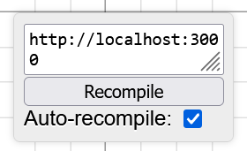

# Desmoscript

**Scroll down for setup instructions**

Desmoscript is a programming language that compiles to Desmos graph state. It is designed to provide the features of Desmos with zero overhead and with a C-like syntax. The syntax is largely inspired by JavaScript, Rust, and Desmos itself.

## Setup & Installation

There are two main ways to use Desmoscript (the former of which is described below):

- **RECOMMENDED:** Through [a VSCode extension](https://marketplace.visualstudio.com/items?itemName=radian628.desmoscript-language-support) which adds language support (syntax highlighting, errors, jump to definition, desmos-in-VSCode, etc.)
- Through [releases](https://github.com/radian628/desmoscript/releases), which I upload occasionally. This is just a standalone compiler executable you can run.

Because of Desmoscript's... unorthodox... compile target, you can't just get it running normally. There is no built-in desmoscript runtime, and it can't output bytecode your machine nor any "real" VM can run. It outputs a Desmos graph, and it runs in Desmos. There are quite a few ways to get that Desmos graph from your file system into Desmos. The one I like to do is outlined below.

**Warning: This extension is still in development and will likely have some bugs**

1. Install [the VSCode extension](https://marketplace.visualstudio.com/items?itemName=radian628.desmoscript-language-support) (linked above)
2. Install [TamperMonkey](https://www.tampermonkey.net/) or another similar browser extension. This extension easily lets you inject scripts into whatever pages you want. It's like an extension for letting you make your own extensions.
3. Install [the Desmoscript Loader](https://gist.github.com/radian628/a9e1a39d3487153c532bdc410727c30d/raw/bda88081b28f9102311128dceeb7487a0ccd4596/extension.user.js) userscript. Open or refresh [Desmos](https://desmos.com/calculator). If you see a little box in the bottom right corner that looks like the image below, it's been properly loaded.



4. Type some desmoscript code into a file. This will do as a proof of concept:

```desmo
y = x ^ 2;
```

5. Run the web server by right clicking the file and selecting "Run Desmoscript Web Server." Upon doing this, a new window should pop up containing some compiler output as well as a URL. If you open the URL, it should be full of Desmos graph state JSON.
6. Paste the URL into the URL box in the Desmos Loader.
7. Hit "recompile" if it doesn't compile automatically!
8. Try loading [./sample.desmo](sample.desmo) if you want to see more features in action.

## Features

https://github.com/radian628/desmoscript/blob/fae6b541793c8e13f38313327a551d944e7529e7/sample.desmo#L1-L33

## Goals of Desmoscript

- **Highly performant**&mdash; doing things the idiomatic way should incur little-to-no performance overhead. If the idiomatic way is not performant, a performant alternative should be available.
- **Easy to both write and read**&mdash; C-like syntax is familiar to most programmers, and has an emphasis on compactness.
- **Able to be effectively used in large projects**&mdash; A proper scoping system, namespacing, and file-splitting capabilities are used to help manage complexity in large projects.
- **Catch as many errors at compile-time as possible.**
- **Allow Desmos to interface with the outside world**&mdash; An extensible macro system should allow Desmoscript to import external data&mdash; for instance, Desmoscript macros could be used to add 3D models, SVG paths, or CSV data to a Desmos graph, automatically formatted as Desmos data.

## Notable Desmoscript Projects

Want to see your project here? Send me a message or open an issue!
| Creator | Description | Source | Graph |
| ------- | ----------- | ------ | ----- |
| radian628 | MONUMENT OF BERNARD (2022-2023 Art Contest Winner) | [Link](https://github.com/radian628/desmoscript/tree/main/examples/3d-scene) | [Link](https://www.desmos.com/calculator/efcdkbpkcu) |
| Lenny-the-burger | 3-space Engine | [Link](https://gist.github.com/Lenny-the-burger/64e0157dd17902ca71e27a05e15bda7a) | [Link](https://www.desmos.com/calculator/rwtgjjwktb) |
| radian628 | 3D Parametric Editor | [Link](https://github.com/radian628/desmoscript/blob/main/examples/parametric-renderer/main.desmo) | [Link](https://www.desmos.com/calculator/puxqfklrpa) |

## Features (non-exhaustive)

- arithmetic
- functions
- lists
- ranges
- points
- list comprehension
- namespaces
- piecewises
- multi-step expressions
- integrals and derivatives
- products and sums
- displayed expressions
- graph settings

## Additional Contributors

Big thanks to the following people for helping with this project:

- @Lenny-the-burger on GitHub.
